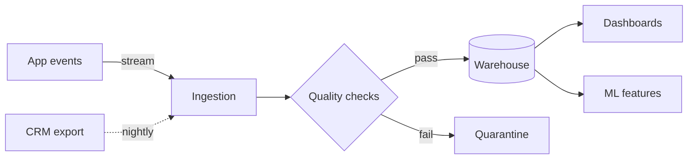

# learn mermaid with phoebe

Six 45-minute sessions + three self-paced deep dives on [mermaid](https://mermaid.js.org) - the text-to-diagram language built into GitHub, Notion, Obsidian, and most docs tools.

**The twist:** every diagram in the course is real mermaid source, rendered live in your browser by mermaid.js - flip any block to Code, copy it, or open it straight in mermaid.live. The course renders itself with the tool it teaches.

**The spine:** one running project. Nova, a small realistic data platform, gets diagrammed end to end across the sessions - architecture flowcharts, sequence and state runtime stories, the warehouse ER model, the roadmap gantt, and finally a branded theme with CLI exports.

## Sessions

| # | Session | Difficulty | Covers |
|---|---------|-----------|--------|
| 1 | Draw with text: diagrams as code | 🟢 | why text beats drag, flowchart basics, the fence, mermaid.live |
| 2 | Tame the spaghetti: flowchart mastery | 🟢 | subgraphs, classDef styling, click links, big-diagram hygiene |
| 3 | Who calls whom: sequence and state | 🟡 | sequence diagrams, control blocks, state machines |
| 4 | Schemas that speak: ER and class | 🟡 | crow's foot ERDs, keys, class diagrams |
| 5 | Six diagrams for humans | 🟠 | gantt, timeline, kanban, gitgraph, journey, mindmap |
| 6 | Make it yours: the pro layer | 🔴 | theming, config, architecture/C4, mmdc CLI, accessibility |
| 6.1-6.3 | Deep dives | self-paced | chart types, structure extras, power config |

Each session: 45 minutes live (3 welcome / ~20 concepts / ~17 build-along / 5 Q&A), then full self-study depth on the same page. Homework, a 3-question quiz, honest docs-coverage notes, and a cheat sheet at the end of every session.

Built against mermaid v11.16 docs. Mermaid moves fast - when something looks off, trust [the official docs](https://mermaid.js.org).

by Phoebe Fu
